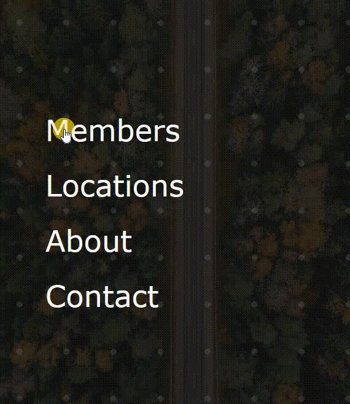

# 🛠 JS - parallax navbar

# 🔗 [Live Preview](https://velvety-malabi-078f22.netlify.app/)

## Welcome! 👋

- Challenging and out-of-the-box navbar exercise featuring parallax effect on background pattern (dots) and background image. This learning project helped me understand better how to play with opacity, background, hover effects and radial gradients.

### Languages and features 👨‍💻 

- JS: arrays, forEach.
- CSS: background properties, flexbox, position properties, opacity, z-index.

Thanks for checking out my projects.